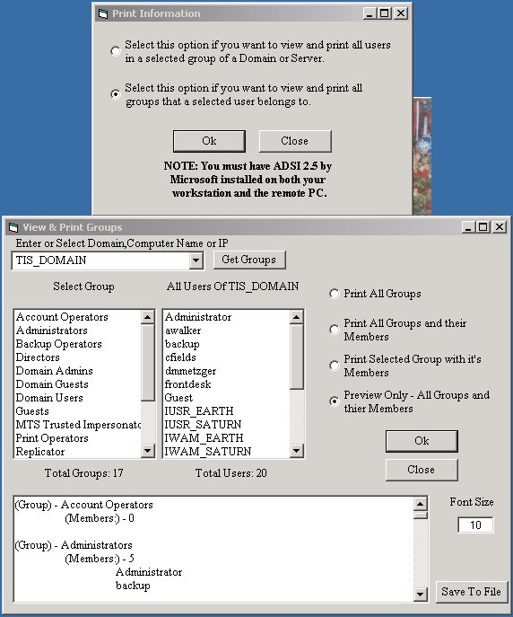



## Group \- User \- Viewer/Print/Save To File

### Description

You will need ADSI 2.5 by Microsoft installed in oder for this program to work.

And you must have enough privlages on the domain or server to read the info.

SEE PIC!

This will work only on Windows NT and Windows 2000 All Versions.

This program was made on VB 6 Service Pack 4

This program has 2 main options.

1. View all the users of a selected group.

2. View all groups of a selected user.

You can print or save to a file all the information it finds.

There are 5 options all togeater.

1. Save to file

2. 3 differant print options.

3. Preview Only

any questions or comments email me - scroft@columbus.rr.com

I am not responsible if anything bad happens useing this program, but nothing should.

You are free to use this code anyway you want, this code is free. Have fun. PLEASE VOTE!!!!!!
 
### More Info
 

             |
---                |---
**Submitted On**   |2000-11-27 14:43:38
**By**             |[Shane Croft](https://github.com/Planet-Source-Code/PSCIndex/blob/master/ByAuthor/shane-croft.md)
**Level**          |Intermediate
**User Rating**    |5.0 (35 globes from 7 users)
**Compatibility**  |VB 6\.0
**Category**       |[Complete Applications](https://github.com/Planet-Source-Code/PSCIndex/blob/master/ByCategory/complete-applications__1-27.md)
**World**          |[Visual Basic](https://github.com/Planet-Source-Code/PSCIndex/blob/master/ByWorld/visual-basic.md)
**Archive File**   |[CODE\_UPLOAD1213011272000\.zip](https://github.com/Planet-Source-Code/shane-croft-group-user-viewer-print-save-to-file__1-13160/archive/master.zip)

